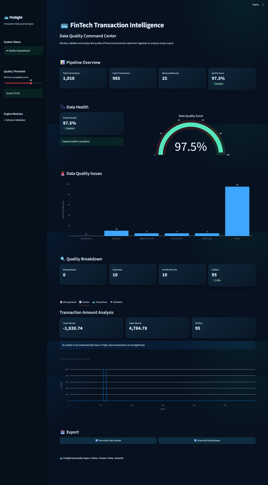
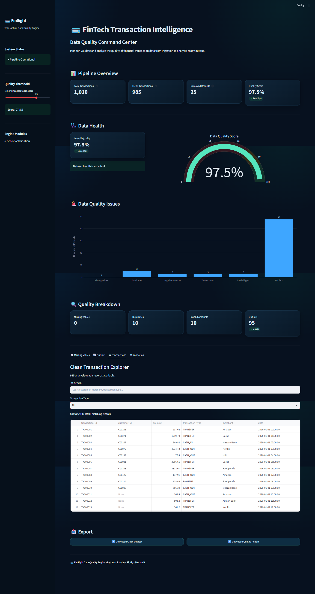
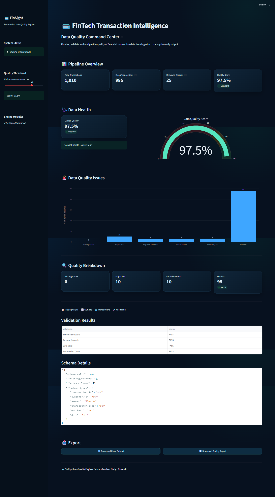

# Fintech — FinTech Transaction Data Quality Engine


## 🚀 Overview

FinSight is an automated financial transaction data-quality
engine designed to identify, analyze, validate, clean, and
monitor data-quality issues in financial transaction datasets.

The system simulates a production-style data-quality workflow
that can be used before downstream analytics and machine
learning pipelines.







## 🏗️ Architecture
```
Raw Transaction Data
        ↓
Schema Validation
        ↓
Data Type Validation
        ↓
Missing Value Analysis
        ↓
Duplicate Detection
        ↓
Business Rule Validation
        ↓
Outlier Detection
        ↓
Automated Cleaning
        ↓
Clean Dataset
        ↓
Quality Report
        ↓
Streamlit Dashboard

```

## ✨ Features
```
- Schema validation
- Data-type validation
- Missing-value analysis
- Duplicate detection
- Negative transaction detection
- Zero-value transaction detection
- Invalid transaction-type detection
- IQR-based outlier detection
- Automated data cleaning
- Data-quality scoring
- JSON quality reporting
- Interactive Streamlit dashboard
- Transaction explorer
- CSV export
- JSON report export
- Automated tests
- Logging
- Configuration management
```


## 📂 Project Structure

```
fintech-data-quality-engine/
├── src/
│   ├── ingestion.py
│   ├── validation.py
│   ├── cleaning.py
│   ├── outliers.py
│   └── reporting.py
├── data/
│   ├── raw/
│   ├── processed/
│   └── reports/
├── notebooks/
├── tests/
├── dashboard/
│   └── app.py
├── config.yaml
├── logger.py
├── main.py
├── requirements.txt
├── README.md
└── .gitignore

```
## ⚙️ Installation
```
Clone the repository:

git clone YOUR_GITHUB_REPOSITORY_URL

Move into the project:

cd fintech-data-quality-engine

Create virtual environment:

python -m venv venv

Activate it on Windows:

venv\Scripts\activate

Install dependencies:

pip install -r requirements.txt
```
## ▶️ Run Pipeline
```
python main.py

The pipeline generates:

- cleaned transaction data
- data-quality report
```
## 📊 Run Dashboard
```
streamlit run dashboard/app.py
```
## 🧪 Run Tests
```
pytest -q
```
## 📈 Data Quality Checks
```
The engine evaluates:

- Missing values
- Duplicate records
- Invalid transaction types
- Negative amounts
- Zero amounts
- Outliers
- Schema consistency
- Data-type consistency
```

## 🎯 Business Value
```
Poor-quality financial data can negatively affect:

- Financial reporting
- Customer analytics
- Risk models
- Fraud detection
- Machine learning models
- Business decision-making

FinSight provides an automated quality-control layer before
financial data reaches downstream analytics and ML systems.

```

## 🔮 Future Improvements
```
- Great Expectations integration
- Data drift detection
- PostgreSQL integration
- Airflow orchestration
- FastAPI data-quality API
- ML-based anomaly detection
- Cloud deployment
- Real-time transaction monitoring
```

## 👨‍💻 Author
```
Rauof Qadir

Software Engineer | Data Science | Machine Learning | FinTech
```